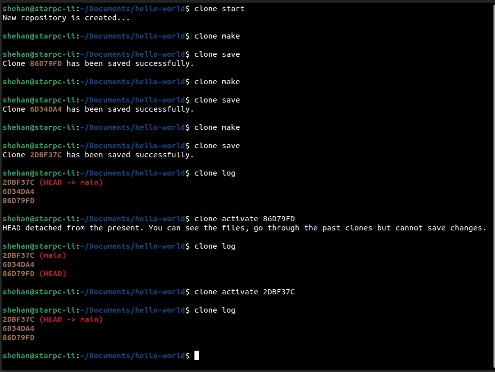
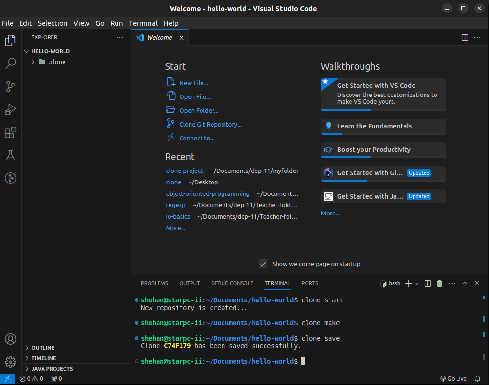
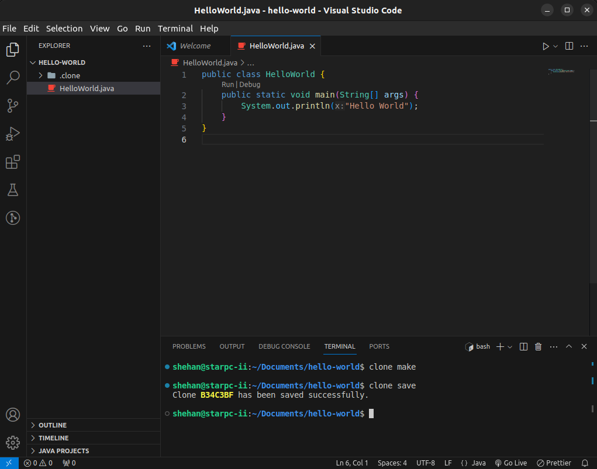
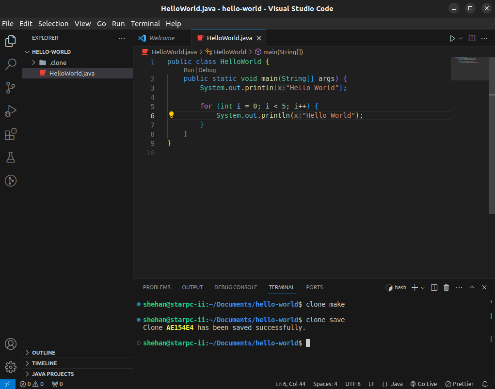
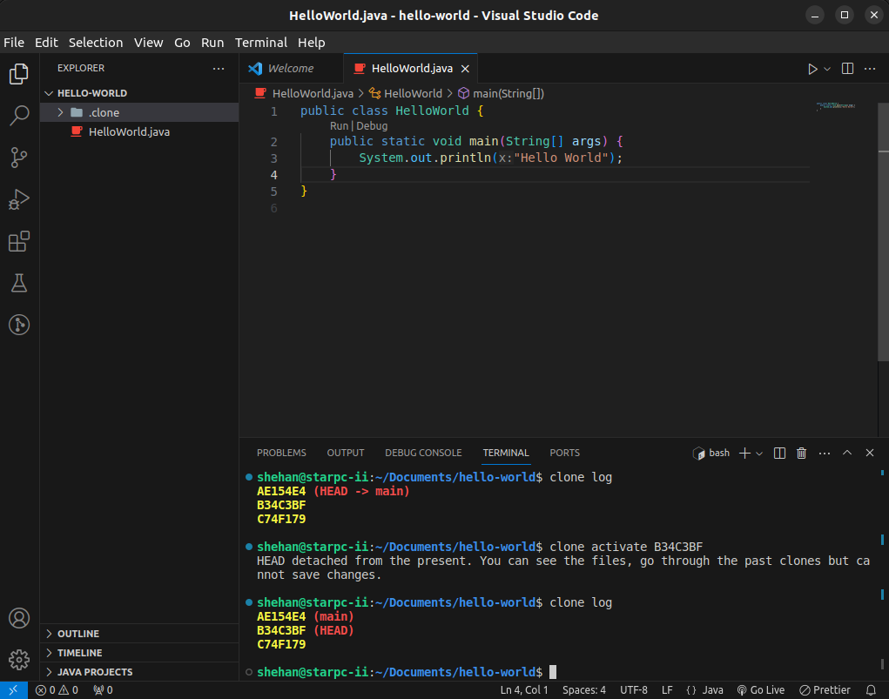
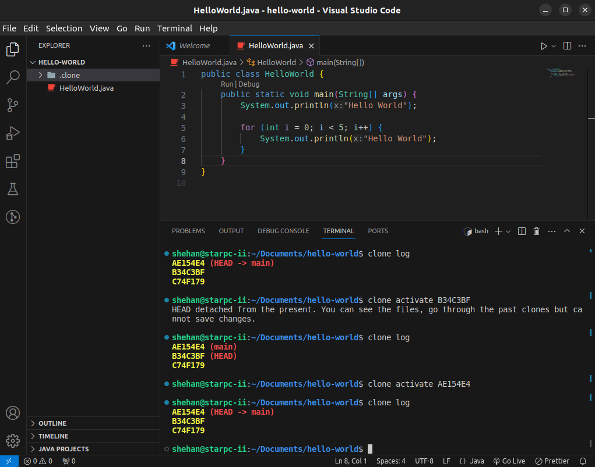

# Clone Version Control System

### Version
0.7.1

### License
Copyright &copy; 2023 Shehan Rathnayake. All Rights Reserved.<br>
This project is licensed under [MIT License](License.txt).

## Clone Installation Guide

The installation files are available for Ubuntu users in ```.deb``` file and ```.tar.gz``` in the directory of [clone-0.7.1-ubuntu-package](clone-0.7.1-ubuntu-package/) in this repository.

### ```.deb``` File Installation
Use ```sudo dpkg -i clone-0.7.1-ubuntu.deb``` to install.


### ```.tar.gz``` File Installation
This ```.tar.gz``` file includes ```clone-vcs``` directory and ```clone``` file. Simply place ```clone-vcs``` in the ```/opt``` directory and ```clone``` file in the ```/usr/bin``` directory.


See the README.txt inside the [clone-0.7.1-ubuntu-package](clone-0.7.1-ubuntu-package/) directory also.

## Clone User Guide

### Introduction
Clone is a version control software designed to manage your projects efficiently. This guide provides instructions on how to use Clone to manage your code repositories effectively.

### Initializing a Clone Repository
To initialize a Clone repository in the specified target directory, run the following command:

```clone start```

Run this command only once to create the repository in the target directory.

### Using Other Commands
After initializing the repository, you can use various other commands for different functionalities as needed in your development workflow.

```clone make``` - Getting ready all the files for saving<br>
```clone save``` - Saving a snapshot of the current project<br>
```clone log``` - Displaying all the clones saved<br>
```clone activate <hashcode>``` - Traversing history through saved clones<br>

## Sample Demonstrations

### Through The Terminal


### Through VSCode







