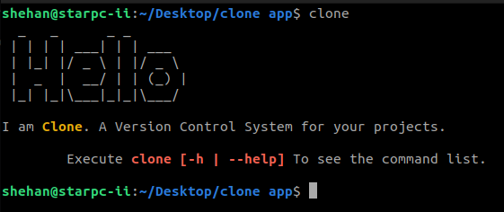
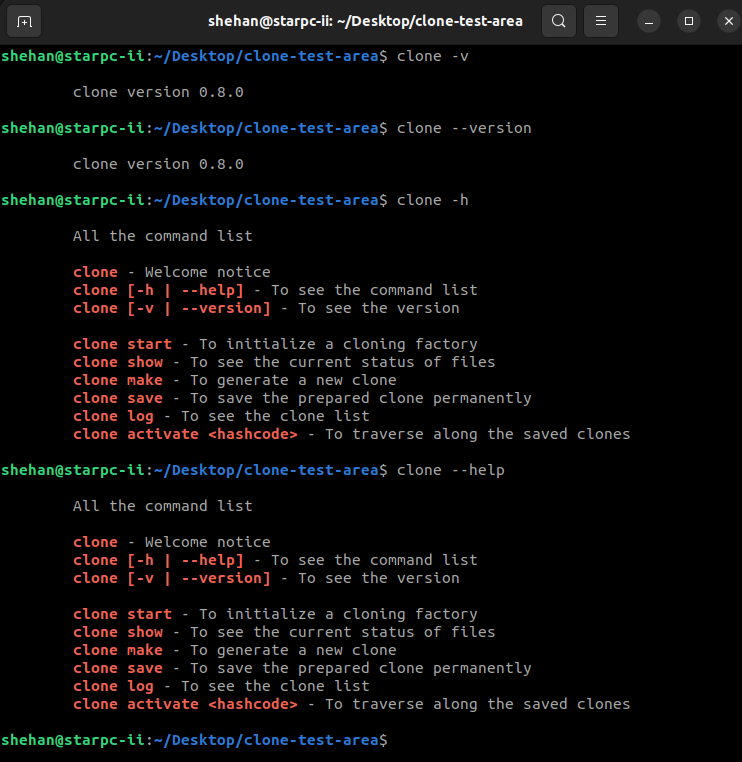
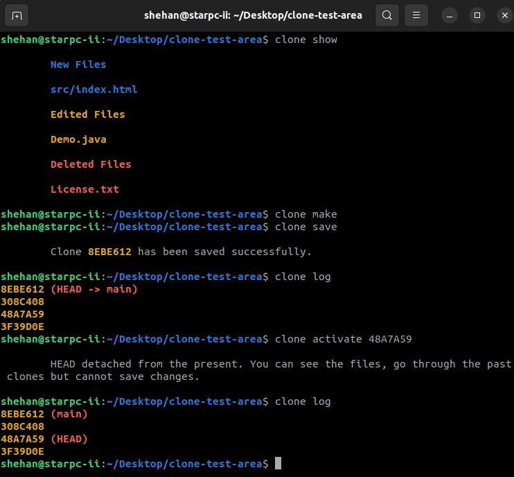
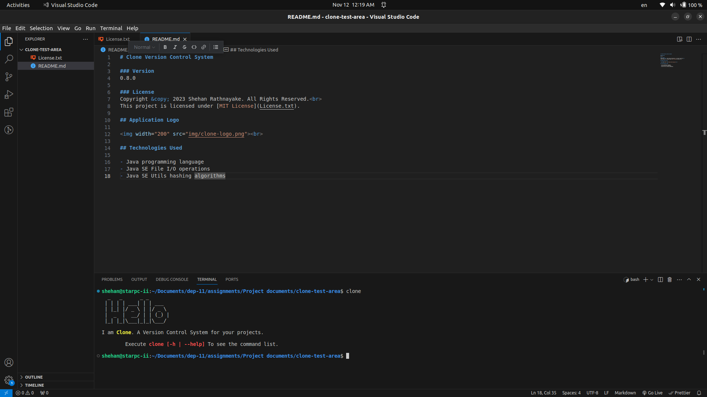
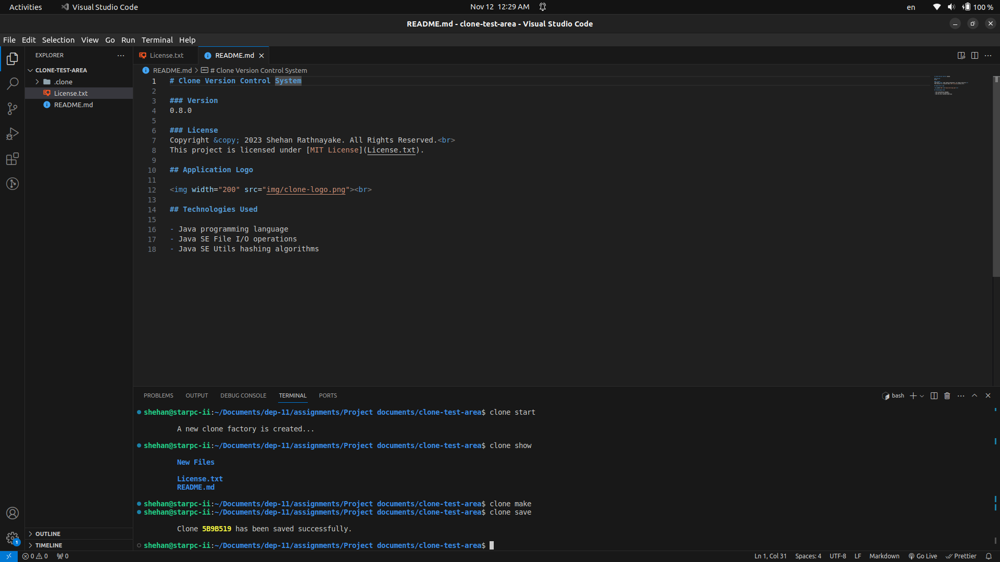
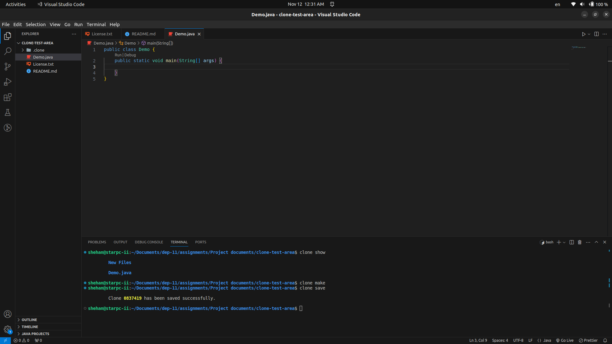
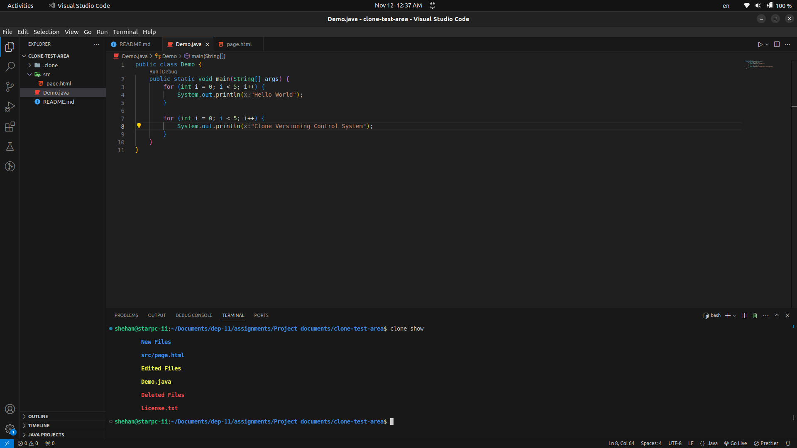
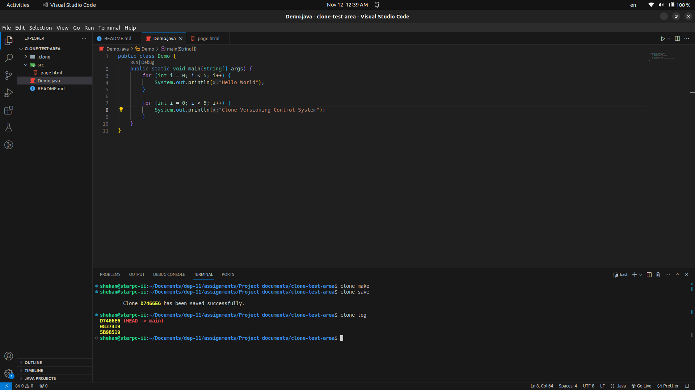
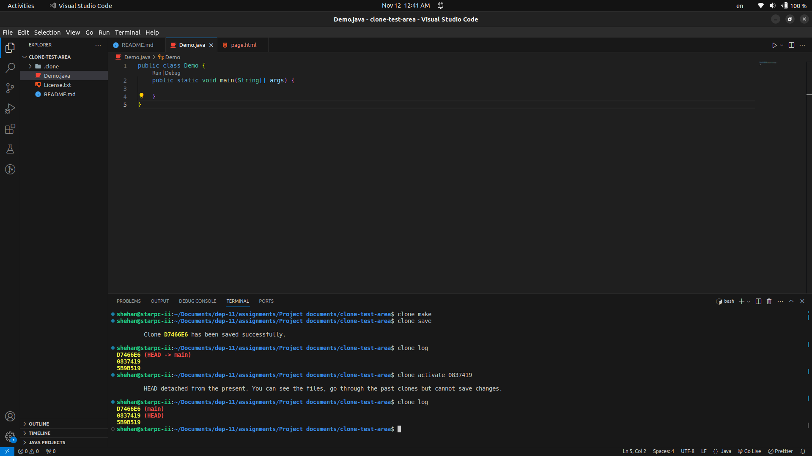

# Clone Version Control System

### Version
0.8.0

### License
Copyright &copy; 2023 Shehan Rathnayake. All Rights Reserved.<br>
This project is licensed under [MIT License](License.txt).

## Application Logo

<br>

### Supported Links

- [Comprehensive Project Story on Medium](https://medium.com/@shehan_rathnayake/clone-a-git-like-version-control-system-ecf70e985de0) 👈

## Technologies Used

- Java programming language
- Java SE File I/O operations
- Java SE Utils hashing algorithms

## Clone Installation Guide

The ```.deb``` file is available for Ubuntu users in this repository.

```sudo dpkg -i clone-0.8.0-ubuntu.deb``` to install.

## Clone User Guide

### Introduction
Clone is a version control software designed to manage your projects efficiently. This guide provides instructions on how to use Clone to manage your code repositories effectively.

```clone``` - To check whether the Clone app has been installed successfully



### Initializing a Clone Repository
To initialize a Clone repository in the specified target directory, run the following command:

```clone start```

Run this command only once to create the repository in the target directory.

### Using Other Commands
After initializing the repository, you can use various other commands for different functionalities as needed in your development workflow.

```clone [-h | --help]``` - To see the command list<br>
```clone [-v | --version]``` - To see the version<br>

```clone show``` - To see the current status of files<br>
```clone make``` - Getting ready all the files for saving<br>
```clone save``` - Saving a snapshot of the current project<br>
```clone log``` - Displaying all the clones saved<br>
```clone activate <hashcode>``` - Traversing history through saved clones<br>





## Sample Demonstrations













### Support

***If you like what I do, maybe consider buying me a coffee*** 🥺 👇

<p><a href="https://www.buymeacoffee.com/shehanrathnayake"> </a></p><br><br>
